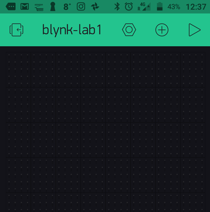

# IoT Home Automation Project

# Proposal
Until now there have been many videos roaming around about IoT Smart-Home Devices controlling Appliances around the house and it caught my attention. Therefore I wanted to design my own simulation of a Smart IoT Device in use for Home Automation. There have also been several tutorial videos regarding controlling appliances over internet. And for that Blynk has been my preference as it was easy to use and user friendly also according to some research. But all those things were based on internet. That means we can control appliances only when we have proper internet connection otherwise that wont work at all.

The Project that I'm going to propose is a Home Automation Based Lamp accompanied with a Relay over a Server using a Raspberry Pi & Blynk App. I’m also going to be using a PIR Sensor. Code for this project will be written in Javascript and Python and will be uploaded on my GitHub in due course.

# Components Required:
- Raspberry Pi 3B board 
-	SD Card
-	Raspbian Operating System
-	1 x 5V Relays
-	1 x Lamp
-	2 x Resistors 150 to 220 ohms  (Optional) 
-	2 x Different Color LEDs  (Optional) 
- Alarm Speaker  (Optional) 
-	Wi-Fi
-	PIR Motion Sensor
-	Smartphone Device
- Breadboard  (Optional) 
-	Jumper Wires
-	Raspberry Pi 3 Model B
-	Blynk Application

<b>Please refer to my Project Analysis in the </b>[HAS Project Analysis Folder](https://github.com/EazyRob97/IoT-Home-Automation-Project/blob/master/HAS%20Project%20Analysis/IoT%20Project%20Analysis%20(HOME%20AUTOMATED%20SMART%20LAMP).pdf)<b> to get a clearer context of this Project.</b>

# Overview of the Project
The Lamp is being controlled using Blynk. Blynk is a fantastic hardware-agnostic IoT platform with customizable mobile apps, private cloud, rules engine, and device management analytics dashboard Blynk was designed for the Internet of Things. It can control hardware remotely, it can display sensor data and it can store and visualise data. I'm using Blynk to specifically control my Relay & Motion Sensor.

The Motion Sensor code is written in Python and is launched through my node.js using a module called [child process](https://nodejs.org/api/child_process.html#child_process_child_process). The child process module allows to me to create child processes in Node.js. Those processes can easily communicate with each other using a built-in messaging system. There are four different ways to create a child process in Node: spawn(), fork(), exec(), and execFile(). You can also watch and learn about the child process module in this [video](https://www.youtube.com/watch?v=3vYfhrIQ2yM).

# Instructions to set up your Pi with all of the scripts it needs:
 The hard parts are done so if you want to just get running with the application, read the following instructions ahead: 

• The first thing you want to do is to download Blynk App here from the [Apple Marketplace](https://itunes.apple.com/us/app/blynk-iot-for-arduino-esp32/id808760481?mt=8) if you're using an Apple Device or [Play Store](https://play.google.com/store/apps/details?id=cc.blynk&hl=en) if you're using an Android Device.
• Create your Account with Blynk when you click into the Application
• Create a New Project with the following details:

  1. Name: "IoT Smart Smart Lamp"or "blynk-lab1" or give it any name that you prefer.
  
  2. Choose Raspberry Pi 3 as the board and the type of network connection you use with the RPi (either Wifi or Ethernet).
  
  
  
• After the project is created, You will see your empty app. You can also learn how to create buttons which you will need for your blynk app in your smartphone in order to communicate with the Raspberry Pi. Here's a [video](https://www.youtube.com/watch?v=Cb3VK0Yl7zY) which will help you understand virtual pins and a practical use of instructions on how to create buttons on your Blynk App. In the mean time, retrieve your project Auth Token in your email (check your junk folder if you can't find it).

• Download/clone this repo 

• Next you need to install the Blynk Library on your Raspberry Pi and since we're going to use Javascript to control the Pi, you will need to do the following:
  You should only carry out the following installations if you don't have node.js installed on your Raspberry Pi otherwise skip the following installations  
  • Check if Node is already on the pi. If so,you are adviced to remove it and reinstall as follows: 
    
    <b> sudo apt-get purge node nodejs node.js -y </b>
    
    <b> sudo apt-get autoremove </b>
    
    
  • Update the package repository and install node:  
    
    <b> curl -sL "https://deb.nodesource.com/setup_6.x" | sudo -E bash - </b>
    
    <b> sudo apt-get install build-essential nodejs -y </b>
    
    <b> sudo apt-get install npm</b>
    
After you've done does steps you should be almost ready to go, just make sure you edit the 'smartDevice.js' script and change the part with 'INSERT-YOUR-TOKEN-HERE' and replace it with your own token that you will get from your email when you already have Blynk installed and setup on your phone.

- Run 'smartDevice.js' which will also run the 'pirTest.py' program from the js program using the child processing module.
- Once connection is established with your smartphone and have your Buttons set up on your Blynk Application then you're good to go.

# Running the program and automatic startup
- I would suggest a reboot after all of the installation process
- To schedule everything to start up automatically on boot, edit /etc/rc.local by typing the command 'sudo nano etc with something like /home/path/to/smartLamp.js but if that doesn't work as it didn't for me, use a relative path like I did with something like: 'cd home/pi/myIoT/smartLamp.js & exit 0'
- rc.local is called automatically on startup. 
- Check troubleshooting for more help or contact me for more details but it should be relatively straight forward.
 
  
  
  Should you have any problems, don't hesitate to contact me on my email at:  [20079462@mail.wit.ie](mailto:20079462@mail.wit.ie)
 or if you find a bug  [open up an issue here](https://github.com/EazyRob97/IoT-Home-Automation-Project/issues)

# Enjoy!!
